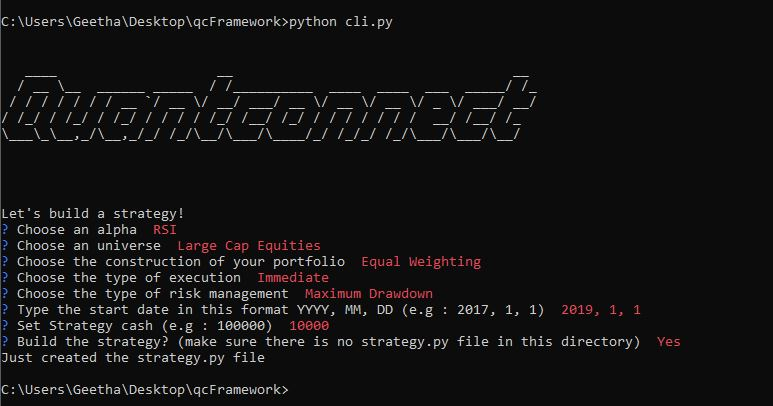

# Algorithmic Wizardry

A CLI for building algorithmic trading strategy (for QC)



## Try it

- install ```framework.py``` in a folder
- go to the folder directory with the command prompt
- install the required librairies : 
                                  - ```pip install pprintpp```
                                  - ```pip install pyfiglet```
                                  - ```pip install PyInquirer```
- type ```python framework.py```
- Build your strategy!

